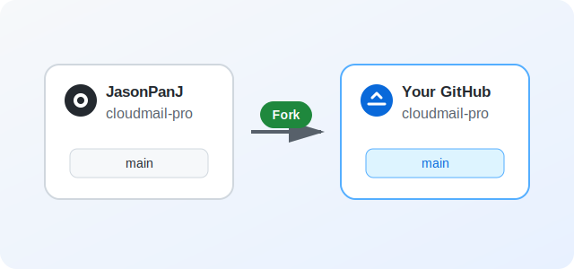
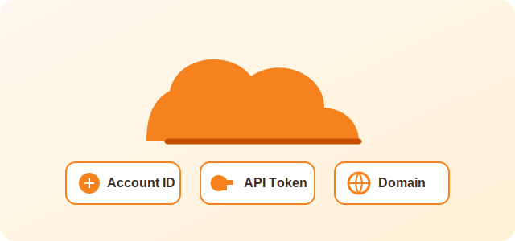
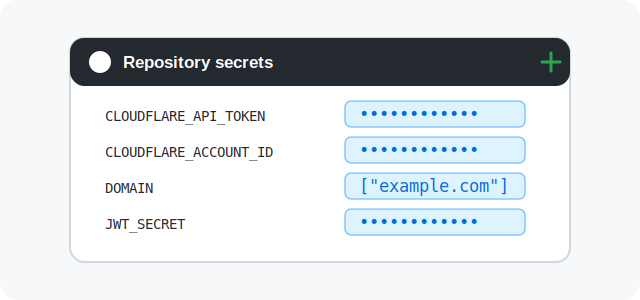
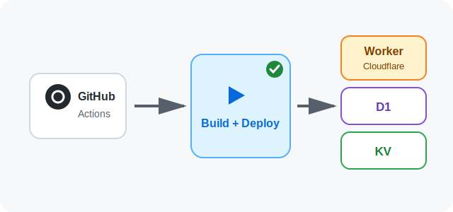
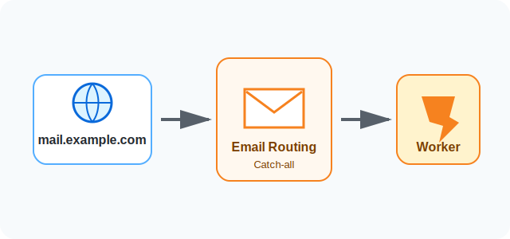

<p align="center">
    
    <h1 align="center">CloudMail Pro</h1>
    <p align="center">A production-validated Cloudflare email service with To, CC, BCC, attachments, and administration</p>
    <p align="center">
       <a href="/README.md" style="margin-left: 5px">简体中文</a> | English 
    </p>
    <p align="center">
        <a href="https://github.com/JasonPanJ/cloudmail-pro/blob/main/LICENSE" target="_blank" >
            
        </a>    
        <a href="https://github.com/JasonPanJ/cloudmail-pro/issues" >
            
        </a>  
        <a href="https://github.com/JasonPanJ/cloudmail-pro/stargazers" target="_blank">
            
        </a>
    </p>
    <p align="center">
        <a href="https://trendshift.io/repositories/20459" target="_blank" >
            
        </a>
    </p>
</p>

## Description
With one domain, you can run a responsive multi-account email service on Cloudflare Workers. CloudMail Pro tracks the stable foundation from [maillab/cloud-mail](https://github.com/maillab/cloud-mail) and adds production-validated CC/BCC support and Cloudflare storage bindings.

## Pro additions

- To, CC, and BCC across compose, drafts, message details, and delivery.
- BCC privacy for internal recipient copies.
- Recipient deduplication and shared permission, quota, statistics, and 50-recipient checks.
- CC/BCC support through both Cloudflare Email Sending and Resend.
- Existing D1/KV bindings with `keep_vars = true` for cloud-managed variables and secrets.
- Current upstream correctness and query-performance fixes.

The production baseline was validated as Worker version `fcc450be-0cfb-42e0-951a-743ea9b3324d`. See the [project comparison](doc/PROJECT_COMPARISON.md) for the detailed analysis.
## Project Showcase

- [Live Demo](https://skymail.ink)<br>
- Deployment: follow the illustrated guide below.


|  |  |
|--------------------------|--------------------------|
|  |  |

## Illustrated Deployment Guide

The included GitHub Actions workflow installs dependencies, builds the frontend, creates or reuses D1/KV, deploys the Cloudflare Worker, and initializes the database.

### 1. Fork the repository

Open [JasonPanJ/cloudmail-pro](https://github.com/JasonPanJ/cloudmail-pro), click **Fork**, and copy the project to your GitHub account. Keep the default branch named `main`.



### 2. Prepare Cloudflare access

1. Sign in to the [Cloudflare Dashboard](https://dash.cloudflare.com/).
2. Copy your **Account ID** from the account page.
3. Create an API Token with Workers Scripts, D1, KV, and account settings permissions.
4. Prepare a mail domain already connected to Cloudflare.



### 3. Configure GitHub Actions secrets

In the forked repository, open **Settings → Secrets and variables → Actions → New repository secret**, then add:

| Secret | Required | Description |
| --- | :---: | --- |
| `CLOUDFLARE_API_TOKEN` | Yes | Cloudflare API Token created above |
| `CLOUDFLARE_ACCOUNT_ID` | Yes | Cloudflare Account ID |
| `DOMAIN` | Yes | Mail-domain JSON array, for example `["example.com"]` |
| `ADMIN` | Yes | Administrator email, for example `admin@example.com` |
| `JWT_SECRET` | Yes | Random long string without `?`, `%`, `#`, `/`, or `\` |
| `CUSTOM_DOMAIN` | Recommended | Custom Worker hostname, for example `mail.example.com` |
| `NAME` | No | Worker, D1, and KV name; defaults to `cloud-mail` |
| `D1_DATABASE_ID` | No | Leave empty to create or reuse a same-name D1 database |
| `KV_NAMESPACE_ID` | No | Leave empty to create or reuse a same-name KV namespace |
| `R2_BUCKET_NAME` | No | Existing R2 bucket name when attachments are required |

Store `JWT_SECRET`, the API Token, and other sensitive values only in Secrets. Never commit them to source code or documentation.



### 4. Run the deployment

1. Open the repository's **Actions** page.
2. Select the Cloudflare deployment workflow and click **Run workflow**.
3. Wait for **Build and Deploy** and **Initialize database** to succeed.
4. Later pushes that change `mail-vue` or `mail-worker` on `main` trigger another deployment automatically.



### 5. Configure the domain and Email Routing

1. In Cloudflare **Workers & Pages**, add the custom domain specified by `CUSTOM_DOMAIN`.
2. Open **Email → Email Routing** and enable routing.
3. Add a **Catch-all** rule, choose **Send to a Worker**, and select the deployed Worker.
4. Open the custom domain and test administrator login, registration, and incoming mail.



> If database initialization fails, first verify that `CUSTOM_DOMAIN` resolves to the Worker. Then visit `https://your-project-domain/api/init/YOUR_JWT_SECRET` to initialize manually; a successful response is `success`.

## Features

- **💰 Low-Cost Usage**: No server required — deploy to Cloudflare Workers to reduce costs.

- **💻 Responsive Design**: Automatically adapts to both desktop and most mobile browsers.

- **📧 Email Sending**: Integrated with Resend, supporting bulk email sending and attachments.

- **🛡️ Admin Features**: Admin controls for user and email management with RBAC-based access control.

- **📦 Attachment Support**: Send and receive attachments, stored and downloaded via R2 object storage.

- **🔔 Email Push**: Forward received emails to Telegram bots or other email providers.

- **📡 Open API**: Supports batch user creation via API and multi-condition email queries

- **🔢 Verification Code Recognition**: Auto-detect codes via Workers AI

- **📈 Data Visualization**: Use ECharts to visualize system data, including user email growth.

- **🎨 Personalization**: Customize website title, login background, and transparency.

- **🤖 CAPTCHA**: Integrated with Turnstile CAPTCHA to prevent automated registration.

- **📜 More Features**: Under development...

## Tech Stack

- **Platform**: [Cloudflare Workers](https://developers.cloudflare.com/workers/)

- **Web Framework**: [Hono](https://hono.dev/)

- **ORM**: [Drizzle](https://orm.drizzle.team/)

- **Frontend Framework**: [Vue3](https://vuejs.org/)

- **UI Framework**: [Element Plus](https://element-plus.org/)

- **Email Service**: [Resend](https://resend.com/)

- **Cache**: [Cloudflare KV](https://developers.cloudflare.com/kv/)

- **Database**: [Cloudflare D1](https://developers.cloudflare.com/d1/)

- **File Storage**: [Cloudflare R2](https://developers.cloudflare.com/r2/)

## Project Structure

```
cloud-mail
├── mail-worker				    # Backend worker project
│   ├── src                  
│   │   ├── api	 			    # API layer
│   │   ├── const  			    # Project constants
│   │   ├── dao                 # Data access layer
│   │   ├── email			    # Email processing and handling
│   │   ├── entity			    # Database entities
│   │   ├── error			    # Custom exceptions
│   │   ├── hono			    # Web framework, middleware, error handling
│   │   ├── i18n			    # Internationalization
│   │   ├── init			    # Database and cache initialization
│   │   ├── model			    # Response data models
│   │   ├── security			# Authentication and authorization
│   │   ├── service			    # Business logic layer
│   │   ├── template			# Message templates
│   │   ├── utils			    # Utility functions
│   │   └── index.js			# Entry point
│   ├── package.json			# Project dependencies
│   └── wrangler.toml			# Project configuration
│
├─ mail-vue				        # Frontend Vue project
│   ├── src
│   │   ├── axios 			    # Axios configuration
│   │   ├── components			# Custom components
│   │   ├── echarts			    # ECharts integration
│   │   ├── i18n			    # Internationalization
│   │   ├── init			    # Startup initialization
│   │   ├── layout			    # Main layout components
│   │   ├── perm			    # Permissions and access control
│   │   ├── request			    # API request layer
│   │   ├── router			    # Router configuration
│   │   ├── store			    # Global state management
│   │   ├── utils			    # Utility functions
│   │   ├── views			    # Page components
│   │   ├── app.vue			    # Root component
│   │   ├── main.js			    # Entry JS file
│   │   └── style.css			# Global styles
│   ├── package.json			# Project dependencies
└── └── env.release				# Environment configuration

```

## Sponsor

If CloudMail Pro helps you, you can support its continued maintenance by scanning the WeChat appreciation code below.

<p align="center">
  
</p>

## License

This project is licensed under the [MIT](LICENSE) license.

## Communication

[Telegram](https://t.me/cloud_mail_tg)
